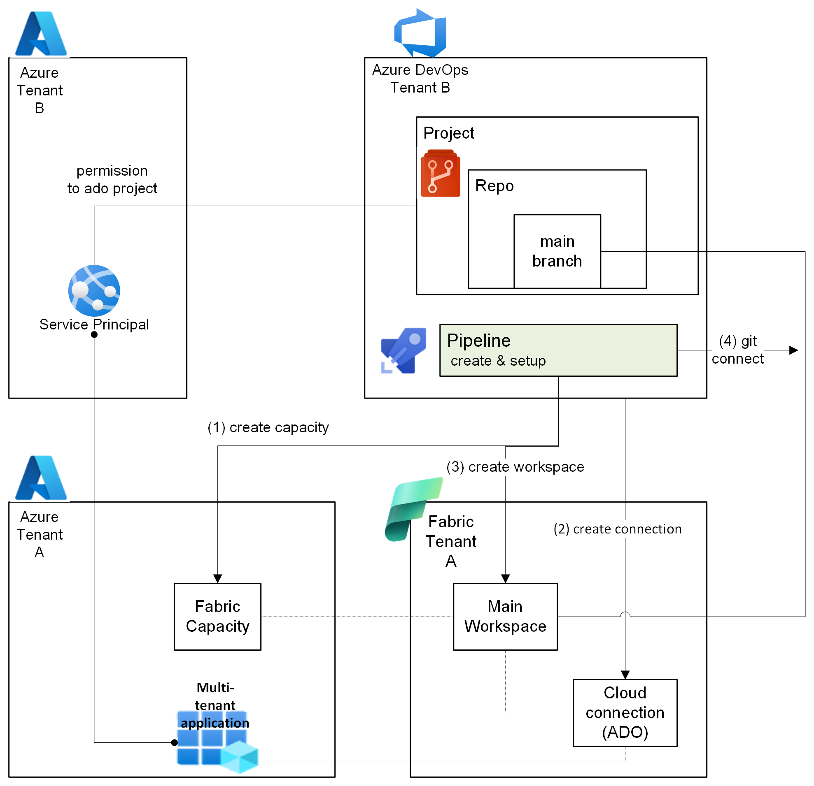
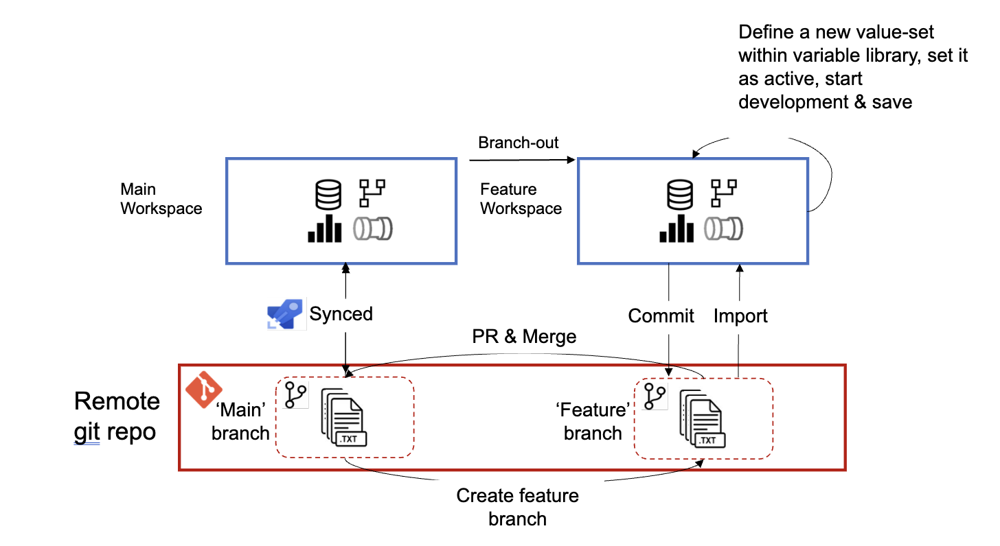

# rr fabcon2025-cicd-demo
This repo represent the Cross-tenant CI-CD automation session for FabCon Vienna 2025.

# STEP 1: Infrastructure create & Git setup​ (files for cli can be found under fab-cli folder)
1. Create a Fabric capacity using CLI 
1. Create ADO cloud connection using Terraform/CLI​
1. Create a main workspaces using Terraform​/CLI
1. Connect the workspace to Git repo using the connection from step 1 using Terraform/CLI (branch: main)​

The Git folder (workspace-files folder) contains the following items:​
1. Data pipeline  with copy-data task
1. Variable library with value-sets for main/dev/test
1. Lakehouse

​
# STEP 2: Work with feature workspace​
1. Create feature workspace by using `Branch-out` operartion via Fabric UI 
1. Work with variable library, develop some items, save and commit
1. Create PR from dev -> main branch
1. Via ADO pipeline automation - update main workspace using Fabric CLI by calling `update-from-git` api

